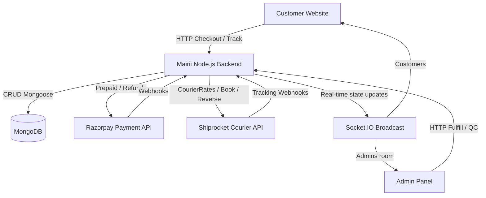

# Mairii Jewels E-Commerce Platform - Backend

This repository houses the business logic, database controllers, and API services powering **Mairii Jewels**, an online jewelry store. 

The platform supports customer storefront operations, admin panel order fulfillment, prepaid/COD payments, automated Shiprocket shipping, returns management, restocking, and real-time Socket.IO event updates.

---

## 1. System Overview



- **Node.js / Express Backend**: Powers the REST API routes, third-party integrations, and event logic.
- **MongoDB / Mongoose**: Serves as the **primary source of truth**. Statuses, inventory counts, and order updates are written to MongoDB first before triggering external APIs or client notifications.
- **Razorpay**: Handles online prepayment capture and automated prepaid refunds.
- **Shiprocket**: Generates shipping rates, books forward courier orders, processes tracking status updates, and schedules reverse pickups for returns.
- **Socket.IO**: Emits real-time state changes (`order.updated`, `payment.updated`, `shipment.updated`, etc.) to the Admin Dashboard and Customer storefront. Note: **Socket.IO is purely for UI updates, never the source of truth.**

---

## 2. Directory Structure

```text
src/
├── app/                  # Express Application instantiation and route registration
├── config/               # Environmental schema, database connections, and Socket.IO singleton
├── common/               # Middlewares (auth, logger, rateLimiters, RBAC, input sanitization)
├── integrations/         # Low-level API clients for Razorpay, Shiprocket, and Cloudflare R2
├── models/               # Compatibility shim wrappers for backwards compatibility
├── modules/              # Domain-Driven Feature modules
│   ├── checkout/         # Pricing rules, order drafts, prepaid & COD checkout service
│   ├── inventory/        # Stock ledger model, available stock adjustment services
│   ├── order/            # Order schemas, admin controllers, audit history model
│   ├── payment/          # Payment model, Razorpay webhook controllers, capture services
│   ├── refund/           # Razorpay prepaid refunds and COD refund records
│   ├── return/           # Return request model, inspections, approvals, reverse pickups
│   ├── shipping/         # Shiprocket client proxy, AWB assign, rates lookup, status mapper
│   └── webhook/          # Webhook Event idempotency checking model and services
├── routes/               # Legacy route aggregators
└── tests/                # Lifecycle workflow verification test suites
```

---

## 3. Implementation Status

| Feature Domain | Status | Key Sub-flows |
| :--- | :--- | :--- |
| **Catalog & Products** | **DONE** | Categories, Lookbooks, Occasions, Products, Sections |
| **Prepaid Payment** | **DONE** | Razorpay Order create, payment signature verification, signature verification raw body |
| **COD Payment** | **DONE** | COD checkout creation, immediate stock decrement, COD delivery mapping, paymentStatus = `COD_COLLECTED` |
| **Forward Shipping** | **DONE** | Serviceability rates lookup, idempotent forward shipment booking, AWB generation, label retrieve |
| **Tracking Webhooks** | **DONE** | Live courier tracking update webhook, signature verification, status mapping |
| **Return Requests** | **DONE** | Customer returns submit, 15-day return window checks, admin approval / rejection |
| **Reverse pickup** | **DONE** | Automated Shiprocket reverse order pickup creation, reverse AWB tracking URL |
| **Inventory & Ledgers** | **DONE** | Atomic stock increment/decrement, transaction ledger audit log (`SALE`, `RETURN_RESTOCK`, `RETURN_DAMAGED`, `RTO_RESTOCK`) |
| **Prepaid Refunds** | **DONE** | Razorpay Refund API request, refund.processed webhook update, refundStatus = `COMPLETED` |
| **COD Refunds** | **DONE** | Manual Bank/UPI details input, manual admin check-off, refundStatus = `COMPLETED` |
| **Order History Logs** | **DONE** | Persistent state change logging (`ORDER_CREATED`, `PAYMENT_CAPTURED`, `SHIPMENT_BOOKED`, etc.) |
| **Webhook Idempotency** | **DONE** | WebhookEvent model checking for Razorpay and Shiprocket webhook duplicates |
| **Real-time Updates** | **DONE** | Socket.IO server setup, admin room dispatch for updates, client resilience |

---

## 4. Topic-Specific Documentation

For detailed technical specs on specific parts of the platform:
1. [Architecture & Request Flow](file:///c:/Users/tanja/Documents/amayraa/Amayra-backend/docs/ARCHITECTURE.md)
2. [Order Lifecycles & State Transitions](file:///c:/Users/tanja/Documents/amayraa/Amayra-backend/docs/ORDER_LIFECYCLE.md)
3. [Prepaid & COD Payment Flow](file:///c:/Users/tanja/Documents/amayraa/Amayra-backend/docs/PAYMENT_FLOW.md)
4. [Forward Shipping & Courier Booking](file:///c:/Users/tanja/Documents/amayraa/Amayra-backend/docs/SHIPPING_FLOW.md)
5. [Returns & Refund Flow](file:///c:/Users/tanja/Documents/amayraa/Amayra-backend/docs/RETURN_REFUND_FLOW.md)
6. [Inventory Tracking & Ledger](file:///c:/Users/tanja/Documents/amayraa/Amayra-backend/docs/INVENTORY.md)
7. [Webhook Verification & Idempotency](file:///c:/Users/tanja/Documents/amayraa/Amayra-backend/docs/WEBHOOKS.md)
8. [REST API Documentation Matrix](file:///c:/Users/tanja/Documents/amayraa/Amayra-backend/docs/API.md)
9. [Local Development, Testing, & Troubleshooting](file:///c:/Users/tanja/Documents/amayraa/Amayra-backend/docs/DEVELOPMENT.md)
